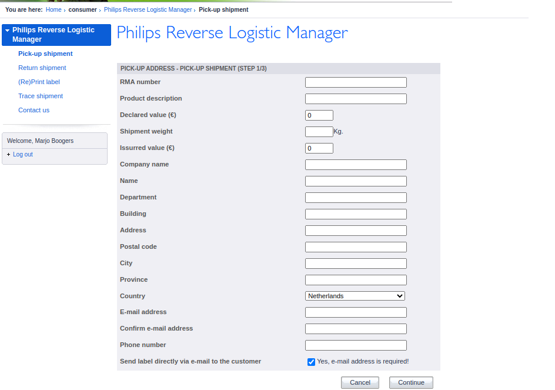

## reverse-logistics

Friday 20 May 2022 - SBJ

---

### Reverse Logitics

The reverse logistics tool will be an enhanced replacement for the current reverse logistics found on the url: [http://philips.rev-logistics.eu/Default.aspx](http://philips.rev-logistics.eu/Default.aspx).

The tool is used by the Consumer Care of Philips to both track & create shipments for their customers. For example when a customer encouters a product defect they will call Consumer Care to create a shipment to pickup the defect product and send a replacement.

### Why replace the tool

The current tool is a solution for only one of the SBJ customers (Philips) and the wish from management is to create a solution all our customers can use.

Another reason is that SBJ has started using Sendcloud for shipments and Sendcloud has an excellent API available which support all the actions we would like to use in this tool. Creating and requesting shipment information is all possible in the API.

### API Documentation

As stated before a huge part of the application will be creating a web interface on top of the Sendcloud API. The sendcloud API documentation is quite extensive and can be found on [https://support.sendcloud.com/hc/nl/articles/360024967012-API-documentatie](https://support.sendcloud.com/hc/nl/articles/360024967012-API-documentatie).

### Customer division

A big improvement over the current tool will be the possibility to make the tool available for all our customers. An important part of the application will thus be to only make shipment information available for the logged in customer.

Users in the application should be connected to a customer and the shipments should also be connected to a customer.

### Functionalities

The current tool has the following functionalities

- Pick-up shipment
- Return shipment
- (Re)Print label
- Trace shipment
- Contact us

### Pick-up shipment

### Return shipment

### (Re)Print label

### Trace shipment

### Contact us

